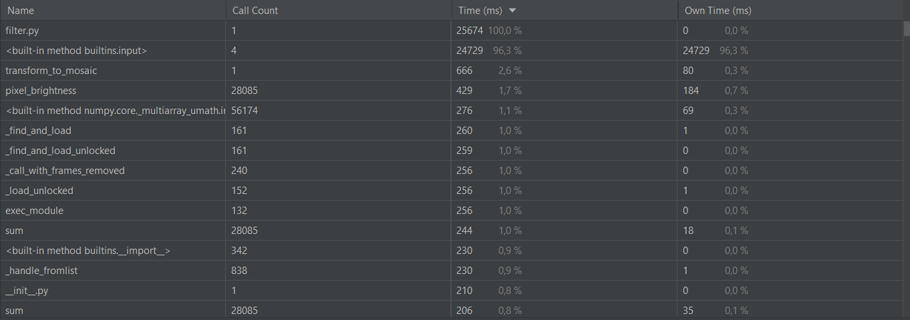
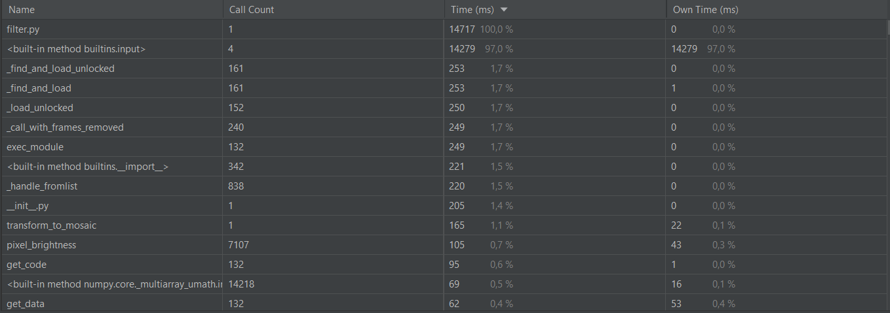
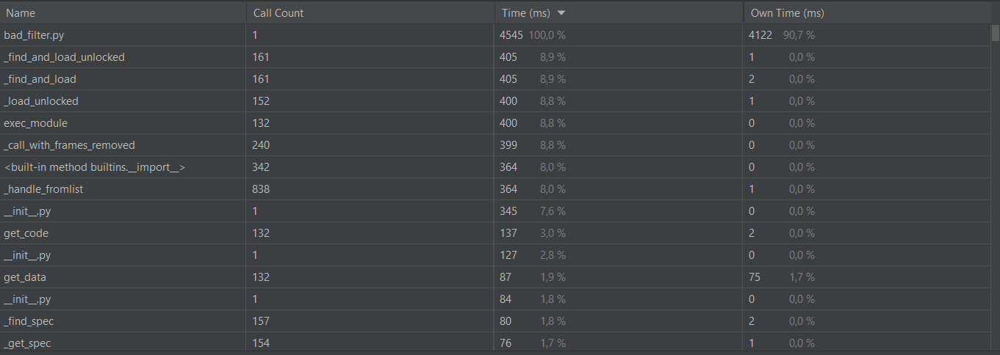
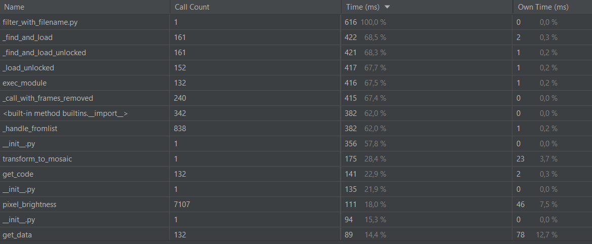
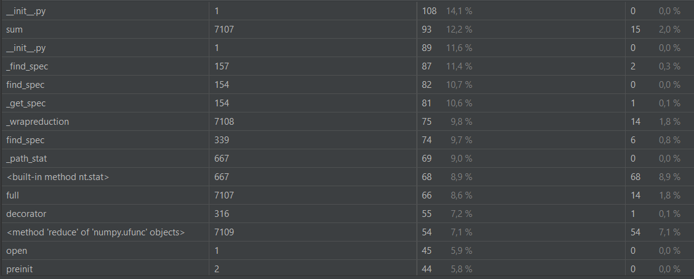
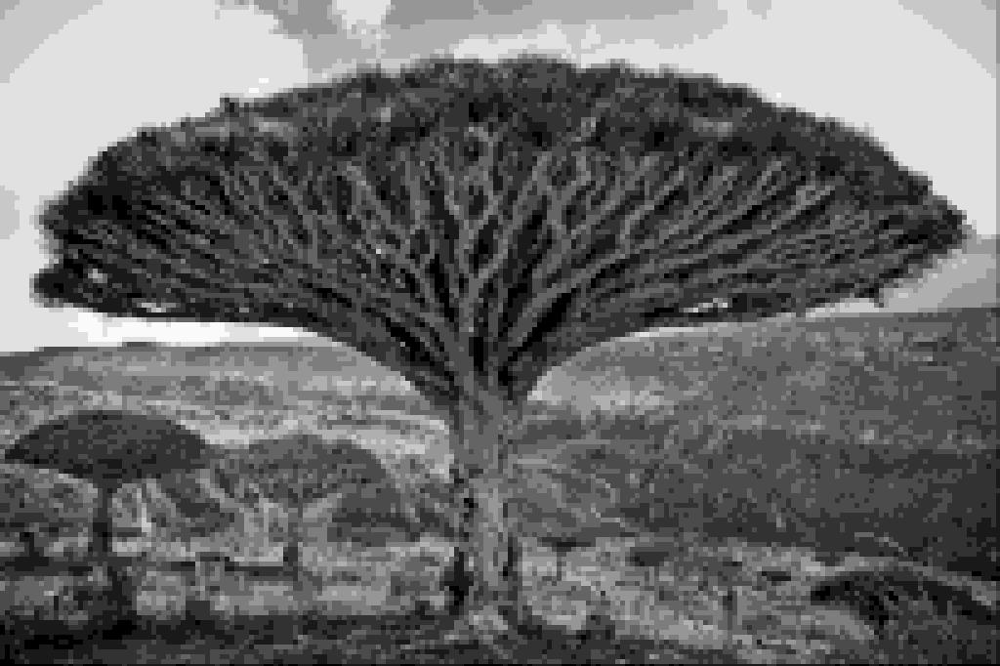

#Постановка задачи:

1. На основании предыдущего проекта сделайте свой репозиторий на GitHub. Поместите туда ваш новый файл filter.py, также в репозиторий поместите первоначальный файл filter.py (old_filter.py).
2. Создайте новый проект. Подключите ваш репозиторий к IDE PyCharm. Загрузите оба файла с помощью Git в PyCharm к себе в проект на компьютер.
3. Добавьте в папку с вашим проектом тестовое изображение, из которого будете получать готовое изображение с фильтром.
4. Добавьте файл в репозиторий и отправьте его на сервер.
Предполагаем, что ваш новый filter.py работает как утилита, где нужно указать во время выполнения имя файла для конвертирования, а также размер блока, и количество градаций серого (также в нем все разделено на необходимые функции и используются все преобразования с матрицами с помощью библиотеки numpy).
5. Запустите с помощью встроенного профилизатора в PyCharm ваш новый filter.py, сделайте скриншот со временем выполнения.
6. Также запустите в профилизаторе old_filter.py. Посмотрите разницу во времени выполнения кода. Полученные скриншоты со временем выполнения с объяснением результатов поместите в файл README.MD
7. Поскольку в вашем файле большая часть времени выполнения затрачивается на ввод данных пользователем, поэтому создайте копию вашего файла filter_with_filename.py, добавьте его также в репозиторий, в котором сразу в код введите имя изображения для конвертирования, а также аналогичные параметры для конвертирования, которые указаны были в первоначальном old_filter.py, а именно размер блока 10 и 50 градаций серого. Также закомитьте полученные правки и отправьте их на сервер.
8. Запустите в профилизаторе файл filter_with_filename.py, сделайте скриншот со временем выполнения этого файла. Полученный скриншот, а также объяснение полученных результатов добавьте в файл README.MD. Также в файл README.MD с помощью wiki-разметки добавьте все изображения до преобразования и после.
9. К выделенным функциям, допишите документацию и doc-тесты в формате: docstring.
10. Проверьте запуск doc-тестов в PyCharm. Сделайте их скриншоты.
11. Закомитьте все изменения на github. Скриншоты doc-тесты с соответствующими комментариями прикрепите в файл README.MD.
12. Проинспектируйте ваш проект в PyCharm. Исправьте все замечания по PEP8. Закомитьте в репозиторий с соответствующей подписью в коммите.
13. Через отладчик вывести на экран в свойствах изображения ширину и высоту, а также тип изображения. Также в отладчике выведите значения ширины блока и количество градаций серого.
14. Сделайте скриншоты результата работы отладчика и вставьте их в файл README.MD. 

#Выполнение:

1. **Запустили профилизатор для файла scale1200.jpg в новом filter.py**
 Получили следующие результаты: для размеров 5 и градаций 50  
 для размеров 10 и градаций 50 
 Больше всего времени было потрачено на ввод. Далее идут основные методы transform_to_mosaic и pixel_brightness.
В них используется много циклов и матричных операций, поэтому неудивительно, что они затрачивают много времени. 
Далее идет встроенный метод numpy numpy.core._multiarray_umath.implement_array_function - диспетчер,
который вызывает реализацию numpy для каждого метода вызываемого объектом numpy. 
Далее идут методы с нижним подчеркиванием, которые отвечают за получение и загрузку изображения. 
exec_module отвечает за загрузку и реализацию модулей, которые были импортированы в данное пространство имен. 
init.py - инициализация проекта, sum - метод numpy, неоднократно используется в методе pixel_brightness. 
2. **Запустили профилизатор в старом filter.py** 
Получили следующие результаты:  
Видим, что потрачено больше времени на некоторые такие же методы
3. **Запустили профилизатор в filter_with_filename.py**, чтобы избавиться от времени потраченного на ручной ввод.  

Видим, что время работы по сравнению со старым фильтром уменьшилось многократно.
Это происходит потому, что работа множества вычислений из старого фильтра в новом была делегирована более эффективным методам из Numpy
На скриншоте профилирования старого фильтра не видно множества вычисляющих методов, которые суммарно работают медленее методов из Numpy.
4. **Отличаются и полученные результаты:** 
Исходное изображение: 
Со старым фильтром: 
С новым фильтром: 
